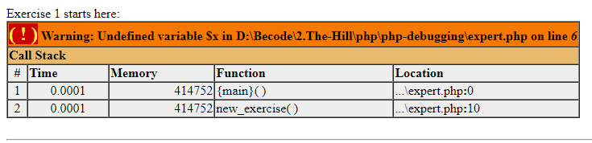

# Debugging, the coward's pest control
For this challenge, we need to: *"Open up the junior.php.broken file, read the comments, fix the code blocks as requested in the comments and put the final file expert.php in the repository folder as requested."*  
The purpose of this challenge is for the learners to give ourselves a solver's mentality!
There is but one way to learn (in my opinion) and that is by making **a lot** of mistakes, fix those mistakes and solemnly swear that you will never ever make that mistake again!
So this challenge is right up my alley.  

So what am I waiting for? Let's squash those bugs baby (except this bug, he's cool).

## Exercise 1: "The First Step"
The IDE itself already told me that the main issue here was that the $x was undefined, but I still wanted to try out the var_dump and see what it would tell me.
It gave me this error:

So here it was clear that the $x was undefined, but also that the function new_exercise wasn't called.
I added $x = "one", I called the function at the end, and then the code started working properly.
Exercise 1 has been a great success!

## Exercise 2: "2 Bug 2 Fixing"
The problem here was that $week[1] = tuesday, and not monday.
That's because arrays always start at [0], not at [1].
Once I adjusted that, the code was completely fixed.
A more creative solution would've been to make 'monday' and 'tuesday' swap places in the $week array.

The next issue, is that the new_exercise() function, doesn't change the number of the exercise, so it always says "Exercise 1 starts here:"
I tried fixing this by incrementing the $x, but it appears that PHP and Javascript have a slight difference here. 
Eventually, I found a neat little trick so that I could increment the $x for everytime the function was called.  
I moved the '$x = 1;' part of the code, **outside** the function. 
Then I added '**global** $x' **inside** the function.  
The function ends with a "$x++;".
This way, the right exercise number appears for each exercise!

## Exercise 3: "Symbols!"
I noticed that the “ “ symbols for the string were the wrong ones, so I replaced them with the correct ones and it started working!
Afterwards, I had to add " " symbols, so the result of the code would look like "Debugged!". 
In order to achieve this, I also had to increase the length of the substr() function.

## Exercise 4: "It's Monday mon"
I don't know who made this exercise, but I wanted to say that this exercise was as evil as it was challenging.
The function and everything was working properly.
I added a var_dump() of both the $week and $day variables, and it was made clear that the $day variable was being adjusted, but the changes weren't showing in the $week variable.
So I knew there was nothing wrong with that part of the code, meaning, that the main suspect was the foreach loop.
After rereading the documentation of that syntax **MULTIPLE** times I finally figured it out.  

The foreach ($week as $day), was missing an '&' sign after the 'as' and before the '$day'.

## Exercise 5: "Z IS NOT THE FATHER!!"
The biggest problem here, was that =<z would result in everything up until 'zz' being printed, while <z resulted in everything up until 'y' being printed.
After looking through the PHP documentation, I was able to find out that < and === weren't the only statements you could use in a for loop!
So while I was reading on the different statements and trying them out, I stumbled upon the '!=' statement. 
This finally fixed the code!