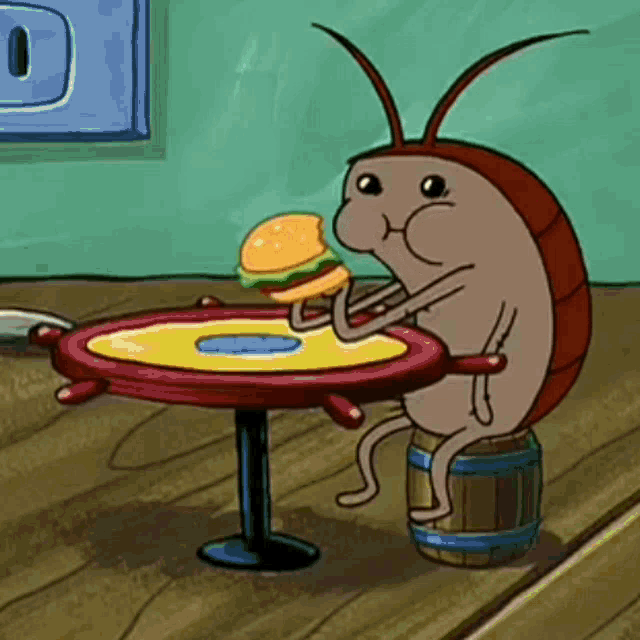

# Debugging, the coward's pest control
For this challenge, we need to: *"Open up the junior.php.broken file, read the comments, fix the code blocks as requested in the comments and put the final file expert.php in the repository folder as requested."*  
The purpose of this challenge is for the learners to give ourselves a solver's mentality!
There is but one way to learn (in my opinion) and that is by making **a lot** of mistakes, fix those mistakes and solemnly swear that you will never ever make that mistake again!
So this challenge is right up my alley.  

So what am I waiting for? Let's squash those bugs baby (except this bug, he's cool).

## Exercise 1: "The First Step"
